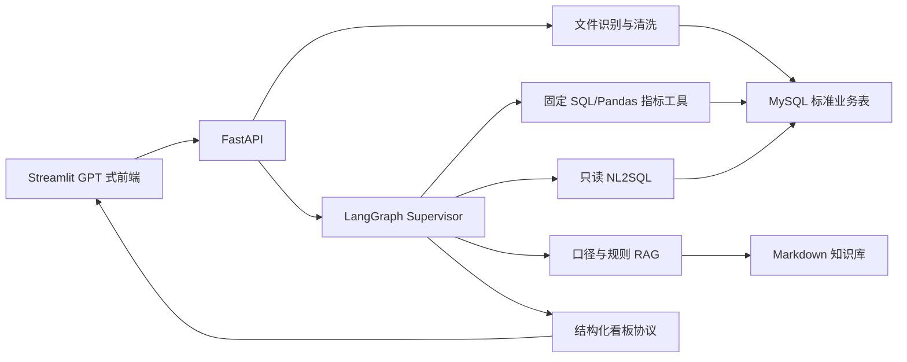

# 基于 LLM Agent 的电商智能数据分析助手——项目设计文档

## 1. 文档定位

本文档是项目唯一的主设计文档，用于统一产品范围、技术架构、数据口径和开发顺序。实现状态以代码和测试为准；学习与面试内容统一维护在 `docs/learning/项目学习与面试指南.md`，不再为每个任务重复生成报告。

## 2. 产品目标

面向不熟悉 SQL 和 BI 工具的电商运营人员，提供类似 GPT 的问答入口。用户上传 CSV 或 Excel 后，系统自动识别数据类型、执行确定性清洗、写入或复用数据集，并根据问题生成相应的指标卡、图表、异常说明和文字建议。

核心原则：

- LLM 负责理解问题、解释结果和组织建议，不计算 GMV、ROI、转化率等指标。
- 指标只由 SQL/Pandas 固定逻辑计算，报表、预警和问答共用同一口径。
- 数据不完整时输出可计算部分，同时列出缺失字段并取消依赖图表。
- 任何自动识别或字段映射不确定时都不写库，转为人工确认。
- 同一文件重复上传时复用已有数据集，不重复写入明细。

## 3. 用户主流程

1. 用户在聊天输入框中提出问题，并可附加一个或多个 CSV/Excel 文件。
2. API 将文件分块写入临时目录，同时计算 SHA256 和文件大小。
3. 若存在相同 SHA256 的成功批次，直接返回原 `dataset_id`，不再解析和写库。
4. 新文件经过结构识别、字段映射、数据清洗、质量审计和事务写入。
5. 对话保存本轮 `dataset_id` 与识别出的标准表，后续问题默认使用该数据集上下文。
6. Agent 判断问题属于指标分析、明细查询还是知识解释。
7. SQL/Pandas 工具返回结构化事实；LLM 只能基于事实与检索资料生成说明。
8. 前端按结构化结果渲染指标卡、趋势、对比、漏斗、异常和建议。

## 4. 总体架构

职责边界：

- Streamlit：聊天、附件、状态和图表渲染，不直连数据库。
- FastAPI：输入校验、文件流式落盘、服务编排和稳定错误协议。
- 导入服务：识别、映射、清洗、去重、事务和质量审计。
- 分析服务：按数据集和时间范围执行数据库聚合，限制明细行数。
- Agent：选择工具，不修改指标公式，不直接相信用户输入的 SQL。
- RAG：仅解释业务口径、清洗规则和产品能力，不能充当事实数据库。

## 5. 数据集与导入设计

### 5.1 数据集身份

每次新导入生成 UUID 格式的 `dataset_id`。文件内容使用 SHA256 生成 `file_hash`；成功批次的哈希唯一。文件名不同但内容相同，仍视为同一数据集。

`import_batch` 记录：

- `dataset_id`、`file_hash`、`file_size`
- 来源文件名、识别表、字段映射和质量摘要
- `processed_rows`、`written_rows`、`skipped_rows`
- 状态、错误码、创建/完成/最后访问时间

失败批次释放唯一文件哈希，允许修复配置或表结构后重新导入。旧批次因无法恢复原文件内容，只回填 `dataset_id`，不伪造哈希。

### 5.2 内存边界

- HTTP 上传：每次最多读取 1 MiB 并直接写临时文件，不使用整文件 `await file.read()`。
- CSV：按可配置 `chunksize` 分块完成映射、清洗和写入，默认 10,000 行。
- Excel：按工作表逐个读取，避免同时保留整个工作簿；当前统一受文件大小上限保护。
- 数据库写入：继续使用 `IMPORT_BATCH_SIZE` 分批插入。
- 分析：显式字段与时间条件下推到 SQL；日 GMV 和行为漏斗直接在 SQL 聚合，禁止无条件 `SELECT *` 加载全部历史明细。
- 明细问答：最多返回 `NL2SQL_MAX_ROWS`，默认 1,000 行。

当前状态：Phase A1～E 均已完成。上传、CSV 解析与数据库写入均具有明确内存边界；分析查询已完成字段/时间条件下推，日 GMV 与行为漏斗在 SQL 聚合，不再无条件加载整张历史明细表。

### 5.3 清洗与质量规则

- 列名通过标准字段别名确定性映射；必填字段缺失或出现歧义时拒绝写入。
- 年龄缺失使用本批有效年龄均值填充；年龄小于 1 或大于 100 视为异常，按既有清洗规则处理并计入质量摘要。
- 导入前生成数据集画像，记录行粒度、实体键、去重策略、置信度和判断理由；该画像同时写入质量审计并返回前端。
- 存在可靠业务键的实体/明细表按完整业务键批内去重并保留首条；匿名用户级漏斗快照没有稳定用户或事件标识，默认保留全部行，避免把独立用户误删为重复数据。跨批重复仍按表的业务语义检查。
- 无法解析的日期、非正金额和缺失必填主键按表契约跳过，并记录原因。
- 有业务价值的大额、波动或异常记录不擅自删除，使用异常标记进入最终报告。
- 工作表和业务表不要求齐全；缺少依赖时列出名称，并取消相应指标或图表。

## 6. 指标与异常口径

指标正式定义以 `docs/knowledge/电商指标口径.md` 和代码为准，覆盖：

- GMV、实际销售额、退款金额、净销售额
- UV、PV、新老访客和严格渠道拆分
- 下单、付款、整体转化率，客单价、件单价、加购率
- 直接/间接/7 日 ROI、CTR、CPM、CPC
- 退款率、退货率、复购率、新客占比

波动统一使用日环比、周同比、月环比三套基线：5%～15% 为轻微，15%～30% 为显著，大于 30% 为严重。阈值、统计天数、ROI 回溯周期和老客判定周期允许后台配置，但公式不能由 LLM 修改。

## 7. 问答、RAG 与安全

路由分为三类：

- 指标分析：调用固定指标工具，返回可视化数据和建议。
- 明细查询：LLM 只生成候选 SQL；本地校验只允许单条 `SELECT/WITH SELECT`、白名单表和受控行数，并使用只读数据库账号。
- 知识解释：先检索 Markdown 规则，再让 LLM 基于命中片段回答并输出引用。

RAG 不读取完整交易表，不计算真实经营数字。后续增强采用结构化引用、混合检索、离线评测和执行追踪；MCP 仅作为淘宝等平台适配层预留，不进入首个可交付版本的关键路径。

## 8. 看板设计目标

前端采用“聊天主区 + 附件卡片 + 动态看板”模式。看板不固定堆叠所有图表，而由问题和可用字段选择组件：

- 顶部：数据集名称、统计时间、质量状态和口径提示。
- 摘要：3～6 个 KPI 卡片及环比方向。
- 主分析：趋势、渠道/商品对比、转化漏斗或投放效率。
- 异常：严重等级、影响指标、可能原因和需要核验的数据。
- 建议：事实依据、建议动作、预期观察指标，不承诺无法验证的收益。
- 降级：字段缺失时显示缺失项和可执行补数建议，不显示空白或误导图表。

视觉实现继续使用 Streamlit 原生容器、Plotly/Altair 图表和统一主题，优先保证可维护性、响应速度与移动端可读性；不直接粘贴来源不明的网上 UI 代码。

## 9. API 规划

已存在接口继续兼容；演进目标如下：

- `POST /api/imports`：上传并导入，返回 `dataset_id`、复用状态和质量摘要。
- `POST /api/imports/inspect`：只识别字段和建议分析，不写库。
- `GET /api/imports/{batch_id}`：查看导入进度和失败原因。
- `GET /api/datasets/{dataset_id}`：查看数据集元数据和可用表。
- `GET /api/datasets/{dataset_id}/quality`：查看清洗审计。
- `POST /api/dashboard/ask`：带一个或多个 `dataset_ids` 的自然语言分析。

## 10. 非功能与验收标准

- 同一文件连续上传两次：第二次返回同一 `dataset_id`，业务表行数不增加。
- 上传过程服务端每次读取不超过 1 MiB。
- 目标 50 MB CSV 导入峰值内存不超过 512 MB（完成 CSV 分块后验收）。
- 分析查询不得无条件加载整张历史明细表。
- 任一失败都返回稳定错误码和可执行恢复建议，不向前端暴露堆栈。
- 指标数值可通过相同数据和相同时间区间重复计算得到一致结果。
- API Key、数据库密码只保存在被 Git 忽略的 `.env`，仓库内仅提供占位配置。

## 11. 开发规划与状态

| 阶段 | 目标 | 状态 |
|---|---|---|
| A1 | 分块上传、文件哈希、`dataset_id`、重复成功批次复用 | 已完成 |
| A2 | CSV 分块识别/清洗/事务写入，Excel 容量保护 | 已完成 |
| B | SQL 字段/时间下推，日 GMV 与行为漏斗聚合，消除无条件整表加载 | 已完成 |
| C | 对话显式绑定 `dataset_id`，支持多数据集切换 | 已完成 |
| D | 结构化引用、多信号检索、评测集与可追踪回答 | 已完成 |
| E | 动态精致看板与电商平台 MCP/API 适配边界 | 已完成 |

每阶段只保留与风险相称的必要测试；完成后更新本表和学习指南，不生成重复 Task 报告。

当前 MVP 的文件导入、确定性计算、数据集问答、RAG 引用、动态看板和平台连接器接口已经闭环。淘宝等真实平台的 OAuth、签名、限流和字段转换属于部署时适配工作；在取得正式应用授权前，不在仓库中伪造可调用实现。
